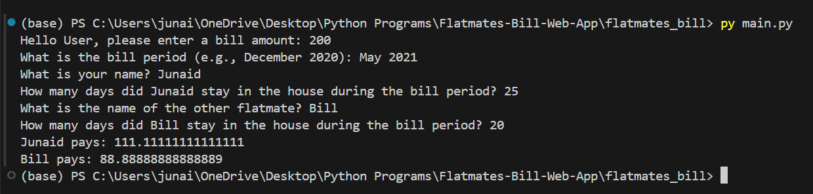

### Title: Flatmates Bill
Description: An app that gets as input the amount of bill for a paticular period and the days that each of the flatmates stayed in the house for that period and returns how much each flatmate has to pay. It also generates a PDF report stating the names of the flatmates, the period, and how much each of them had to pay. 

- looking at nouns.. 
```
object type = class
```
##### Objects: 
```
Objects: Bill:
            amount
            period
         Flatmate:
            name
            days_in_house
            pays(bill)
         PdfReport:
            filename
            generate(flatmate1, flatmate2, bill)
```


###### Results and Output

Program Run: 


Generated PDF result: 


Demo: <br>


